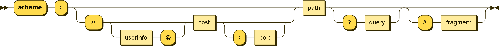

# Lesson 1: Welcome; URL Shortener

## Goals

- Everybody is well acquainted
- The course is introduced and understood
- Requirements and Instructions to set up the machine are clear
- The semester project is introduced

## What is Software engineering?

Software engineering is an engineering approach on a software development of systematics application.

A software engineer is a person who applies the principles of software engineering to design, develop, maintain, test,
and evaluate computer software. The term programmer is sometimes used as a synonym, but may also lack connotations of
engineering education or skills.

## Basic Outline of software engineering

1. Software requirements
2. Software design
3. Software construction
4. Software testing
5. Software maintenance

Systems design is the process of defining the architecture, product design, modules, interfaces, and data for a system
to satisfy specified requirements. Systems design could be seen as the application of systems theory to product
development.

## URL Shortener - Requirements

### What is a web/application server?

A web server is computer software and underlying hardware that accepts requests via HTTP (the network protocol created
to distribute web content) or its secure variant HTTPS. A user agent, commonly a web browser or web crawler, initiates
communication by making a request for a web page or other resource using HTTP, and the server responds with the content
of that resource or an error message. A web server can also accept and store resources sent from the user agent if
configured to do so.

The hardware used to run a web server can vary according to the volume of requests that it needs to handle. At the low
end of the range are embedded systems, such as a router that runs a small web server as its configuration interface. A
high-traffic Internet website might handle requests with hundreds of servers that run on racks of high-speed computers.

### What is a URL?

A Uniform Resource Locator (URL), colloquially termed a web address, is a reference to a web resource that specifies
its location on a computer network and a mechanism for retrieving it. A URL is a specific type of Uniform Resource
Identifier (URI), although many people use the two terms interchangeably. URLs occur most commonly to
reference web pages (http) but are also used for file transfer (ftp), email (mailto), database access (JDBC), and many
other applications.

Most web browsers display the URL of a web page above the page in an address bar. A typical URL could have the
form http://www.example.com/index.html, which indicates a protocol (http), a hostname (www.example.com), and a file
name (index.html).

### What is a URL Shortener service?

### What next? Let's gather requirements!

We go into break out session and discuss what are the requirements for our URL Shortener service. At the end of the
class, we should have this documented, and we will focus on building a system that satisfies those requirements over the
course fo this semester
